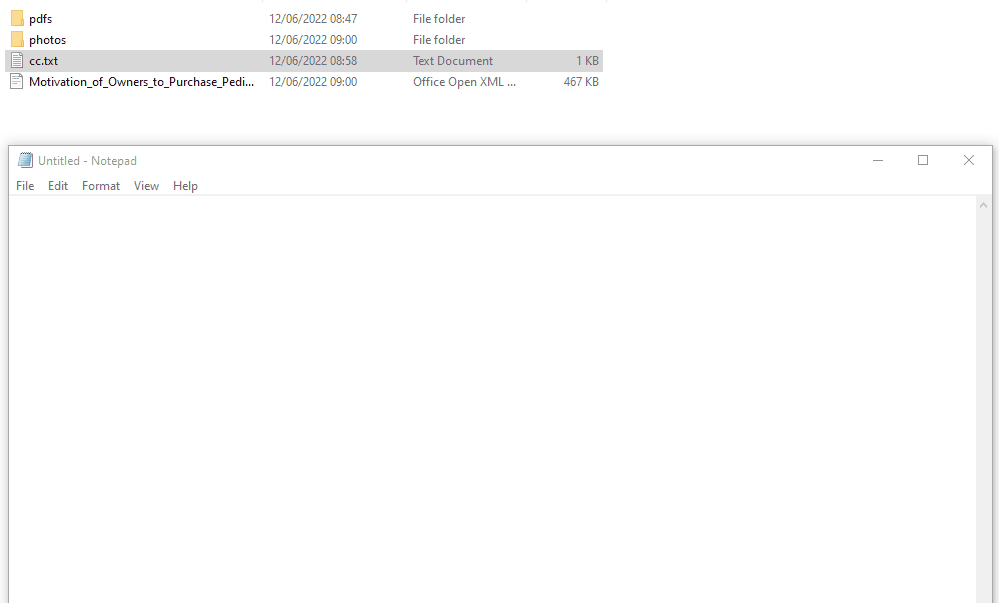
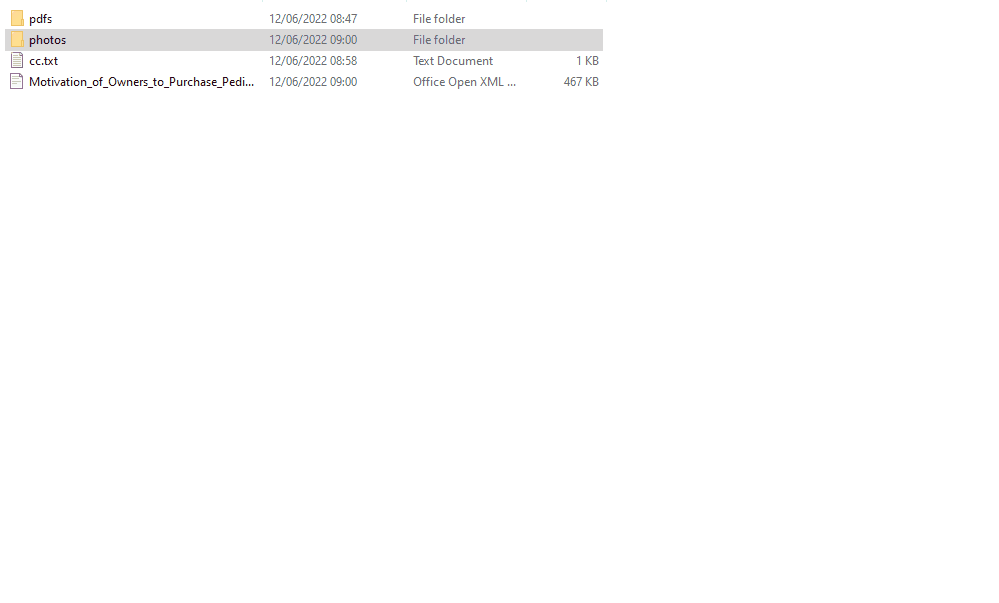
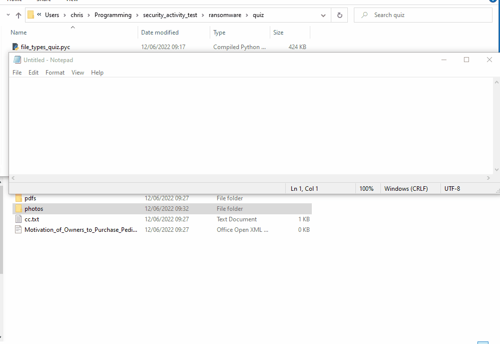

# make_security_exciting
Ideas for new KS3 teaching resources on 'security'

// All students informed at the start of the lesson that activities are not to be repeated outside of the classroom.

## fake_ransomware.py

Students get a new sandbox account and explore the 'mystery' files contained on the user's drive. They are then told to download and complete a quiz about file names, types etc - but this is instead a Python script that encrypts the files they have been looking at (WannaCry style).

### Items for discussion:

- what is ransomware?
- what was WannaCry?
- why are executable files dangerous?
- what's a .pyc? .exe? .apk? .bat?

>>>

## fake_ddos.py
Discussion around how sending repeated GET request to a server does not lead to a successful DoS attack.

// tbc... not very successful in current form

- `requests` libary was only installed in school on Python 3.10
- old versions of Python still lingering, confusing Year 8 students!
- it's not clear what the outcome of the task is to non-programmers
- need to set up a dummy network (a LAN of RPis?) to model an actual (D)DoS attack?